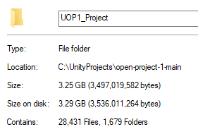
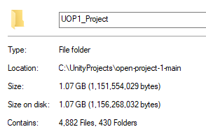

# Clean-Unity-Project
A python script that removed temporary files and caches of a Unity Project.

Before Clean             |  After Clean
:-------------------------:|:-------------------------:
  |  

# Description
This script will remove all files except for `Assets`, `Library`,`Packages`, and `ProjectSettings`. Also, inside `Library`, it will remove anything that does not have extension of `.asset`. 

Any other tools provided by Unity Package Manager will need to Reinstall, for example: `Input System` or `Universal RP`.

# Instruction
1. Place `clean.py` under your UnityProject directory where the `Assets`, `Library`, and `ProjectSettings` is at.
2. `cd` to the directory
3. run `python clean.py`
4. DONE

# Disclaimer
- USE AT YOUR OWN RISKS!
- Author is not responsible for any files that accidentally deleted, please make sure that you understand the code before using it. 

